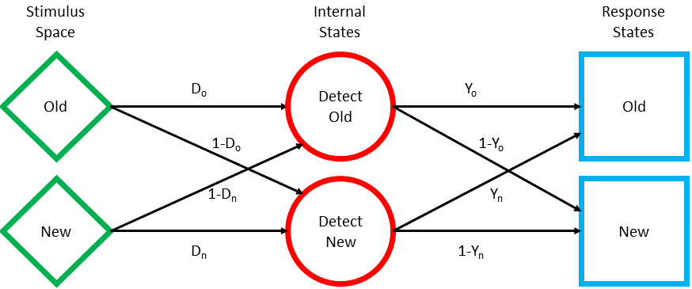

```{css css, echo=FALSE}
.main-container {
    max-width: 1100px;
  }
```

```{r setup, include=FALSE}
knitr::opts_chunk$set(echo = FALSE, fig.align = "center", cache=TRUE)
library(rprojroot)
library(tidyr)
library(ggplot2)
library(kableExtra)
library(optimx)
library(foreach)
library(dplyr)
root_dir <- rprojroot::is_rstudio_project$find_file()
```

```{r load_data, cache.extra = tools::md5sum(file.path(root_dir, "data","SvDPRec.Rdata"))}
load(file.path(root_dir, "data","SvDPRec.Rdata"))
test <- select(test, -list)
```

```{r cell_counts, dependson=c("load_data")}
delayed_counts_by_sub_bias <- filter(test, !is.na(type)) %>%
  select(-starts_with("speeded")) %>%
  rename(correct = delayed_correct) %>%
  count(subject, strength, pOld, correct) %>%
  complete(subject, strength, pOld, correct,
           fill = list(n=0)) %>%
  unite(col = "resp_type", strength, correct) %>%
  spread(resp_type, n) %>%
  rename(FA = L_FALSE, CR = L_TRUE,
         M_S = S_FALSE, H_S = S_TRUE,
         M_W = W_FALSE, H_W = W_TRUE) %>%
  mutate(L_N = FA + CR,
         S_N = M_S + H_S,
         W_N = M_W + H_W) %>%
  select(subject, pOld, FA, L_N, H_S, S_N, H_W, W_N)

```

```{r empirical_roc_data, dependson="cell_counts"}
obs_ROC_data <- mutate(delayed_counts_by_sub_bias,
                       FAR = FA/L_N,
                       HR_W = H_W/W_N,
                       HR_S = H_S/S_N,
                       pOld = sprintf("%2.0f%%", pOld*100)) %>%
  select(subject, pOld, FAR, HR_W, HR_S) %>%
  gather(key="strength", value="HR", HR_W, HR_S) %>%
  mutate(strength = sub("HR_", "", strength)) %>%
  select(subject, pOld, strength, FAR, HR)

avg_obs_ROC_data <- group_by(obs_ROC_data, pOld, strength) %>%
  summarise_at(.vars = c("FAR", "HR"), .funs = "mean") %>%
  ungroup()
```

```{r null_LL, dependson="cell_counts"}
null_LL <- mutate(delayed_counts_by_sub_bias,
                  FA_LL = dbinom(FA, L_N, FA / L_N, log = TRUE),
                  HW_LL = dbinom(H_W, W_N, H_W / W_N, log = TRUE),
                  HS_LL = dbinom(H_S, S_N, H_S / S_N, log = TRUE),
                  LL = FA_LL + HW_LL + HS_LL) %>%
  select(subject, pOld, LL) %>%
  group_by(subject) %>%
  summarise(null_LL = sum(LL))
```


```{r LT}
LT_LL <- function(theta, counts) {
  
  FA <- numeric(length(counts$FA))
  HR_W <- numeric(length(counts$H_W))
  HR_S <- numeric(length(counts$H_S))
  bias <- theta[c('bias.C', 'bias.N', 'bias.L')]
  
  for (i in 1L:length(bias)) {

      if (bias[i] < 0) {
        FA[i] <- theta['dNew.L'] * (bias[i] + 1)
        HR_W[i] <- theta['dOld.W'] * (bias[i] + 1)
        HR_S[i] <- theta['dOld.S'] * (bias[i] + 1)

      } else {
        FA[i] <- theta['dNew.L'] + (1 - theta['dNew.L']) * bias[i]
        HR_W[i] <- theta['dOld.W'] + (1 - theta['dOld.W']) * bias[i]
        HR_S[i] <- theta['dOld.S'] + (1 - theta['dOld.S']) * bias[i]
      }
  }


  LL <- c(dbinom(counts$H_S, size = counts$S_N, prob = HR_S, log=TRUE),
          dbinom(counts$H_W, size = counts$W_N, prob = HR_W, log=TRUE),
          dbinom(counts$FA, size = counts$L_N, prob = FA, log=TRUE)
          )
  return(-sum(LL))
}
```

```{r fit, dependson=c("cell_counts", "LT")}

LT_fits <- foreach(sub = split(delayed_counts_by_sub_bias,
                               delayed_counts_by_sub_bias$subject),
                   .packages = c('optimx')
                   ) %do% {

  fit <- optimx(par = c("dNew.L"=.5, "dOld.W"=.5, "dOld.S"=.75,
                        bias=c('C'=-.5, 'N'=0, 'L'=.5)
                        ),
                fn = LT_LL,
                method = "nlminb",
                itnmax = 3000,
                lower = c(0, 0, 0, -1, -1, -1),
                upper = c(1, 1, 1,  1,  1,  1),
                control = list(kkt=FALSE),
                counts = sub
                )
  fit$subject <- sub$subject[1]
  fit
  }

LT_fits_df <- bind_rows(LT_fits)
```

```{r parameter_summaries, dependson="fit"}
LT_params <- select(LT_fits_df, subject, dNew.L:bias.L)
LT_params_avg <- summarise_at(LT_params,
                              .vars = c("dNew.L", "dOld.W", "dOld.S", "bias.C", "bias.N", "bias.L"),
                              .funs = "mean"
                              )
```

```{r GOF, dependson="fit"}
GOF <- mutate(LT_fits_df,
              LL = -value) %>%
  select(subject, LL, fevals, gevals, niter, convcode) %>%
  left_join(null_LL, by="subject") %>%
  mutate(calc_G2 = -2*(LL - null_LL)) %>%
  mutate(df = 3,
         p.value = pchisq(calc_G2, df=df, lower.tail = FALSE)
         ) %>%
  select(subject, LL, null_LL, calc_G2, df, p.value, fevals:convcode)

GOF_sum <- select(.data = GOF, subject, LL, null_LL, calc_G2, df) %>%
  summarise_at(.vars = c("LL", "null_LL", "calc_G2", "df"),
               .funs = "sum"
               ) %>%
  mutate(p.value = pchisq(calc_G2, df=df, lower.tail = FALSE))

rm(LT_fits_df)
```

## Low-Threshold Model




Following [Kellen, Erdfelder, Malmberg, Dubé, & Criss (2016)](https://doi.org/10.1016/j.jmp.2016.03.001)

$$
p(O \vert O) =  \left\{
  \begin{array}{lr}
    D_o(b+1), & \text{if } b\lt0\\
    D_o + (1-D_o)b, & \text{if } b\ge 0 
  \end{array}
\right.
\\
p(O \vert N) =  \left\{
  \begin{array}{lr}
    D_n(b+1), & \text{if } b\lt0\\
    D_n + (1-D_n)b, & \text{if } b\ge 0 
  \end{array}
\right.
$$
with $b = Y_n - Y_o$ and $-1 \le b \le 1$

Conservative "Lower Limb" ROC
$$
HR = \frac{D_o}{D_n}FA
$$
Conservative "Lower Limb" ROC
$$
HR = D_o + \frac{1 -D_o}{1-D_n}(FA - D_n)
$$

## Results

```{r ROC, cache=TRUE, dependson="parameter_summaries"}
FAR_points <- seq(0, 1, .01)
LT_ROC_preds <- rowwise(LT_params) %>%
  mutate(LT = list(
    data.frame(FAR = rep(FAR_points, 2),
               strength = rep(c("W", "S"), each = length(FAR_points)),
               HR_lower = c( (dOld.W/dNew.L)*FAR_points,
                             (dOld.S/dNew.L)*FAR_points
                            ),
               HR_upper = c( dOld.W + (1-dOld.W)/(1-dNew.L)*(FAR_points-dNew.L),
                             dOld.S + (1-dOld.S)/(1-dNew.L)*(FAR_points-dNew.L)
                            ),    
               type = "pred")
    )) %>%
  select(subject, LT) %>%
  unnest() %>%
  mutate(HR = pmin(HR_lower, HR_upper)) %>%
  select(subject, FAR, strength, HR, type)

LT_ROC_preds_avg <-
  transmute(LT_params_avg,
         LT = list(
    data.frame(FAR = rep(FAR_points, 2),
               strength = rep(c("W", "S"), each = length(FAR_points)),
               HR_lower = c( (dOld.W/dNew.L)*FAR_points,
                             (dOld.S/dNew.L)*FAR_points
                            ),
               HR_upper = c( dOld.W + (1-dOld.W)/(1-dNew.L)*(FAR_points-dNew.L),
                             dOld.S + (1-dOld.S)/(1-dNew.L)*(FAR_points-dNew.L)
                            ),    
               type = "pred")
    )) %>%
  unnest() %>%
  mutate(HR = pmin(HR_lower, HR_upper)) %>%
  select(FAR, strength, HR, type)
```

```{r ROC_avg_plot, dependson="ROC"}
ggplot(LT_ROC_preds_avg,
       aes(x=FAR, y=HR, linetype=strength)) +
  geom_line(size=1.75) +
  geom_point(aes(color=factor(pOld)),
             data = avg_obs_ROC_data,
             size=4) +
  scale_x_continuous("False Alarm Rate", limits = c(0,1),
                     labels = c(0,0.25, 0.5, 0.75, 1)) +
  scale_y_continuous("Hit Rate", limits = c(0,1)) +
  scale_linetype_discrete("Item",
                          labels=c("W" = "'Weak' Target",
                                   "S" = "'Strong' Target")) +
  scale_color_manual("p(Old)", values = c("#d82d2d", "#d8d834", "#17b50c")) +
  guides(colour = guide_legend(override.aes = list(size = 4)),
         shape = guide_legend(override.aes = list(size = 4))) +
  coord_fixed() +
  ggtitle("LT Model ROC (Average)") +
  theme_bw(base_size = 16) +
  theme(plot.title = element_text(hjust=.5),
        strip.background = element_blank(),
        legend.key.width = unit(10,"mm")
        )
```

```{r ROC_sub_plot, dependson="ROC", fig.height=10, fig.width=10}
ggplot(LT_ROC_preds,
       aes(x=FAR, y=HR, linetype=strength)) +
  geom_line(size=.8) +
  geom_point(aes(color = factor(pOld)),
             data = obs_ROC_data) +
  facet_wrap(~ subject,
             labeller = labeller(subject = label_both,
                                 .multi_line = FALSE),
             ncol=4) +
  scale_x_continuous("False Alarm Rate", limits = c(0,1),
                     labels = c(0,0.25, 0.5, 0.75, 1)) +
  scale_y_continuous("Hit Rate", limits = c(0,1)) +
  scale_color_manual("pOld", values = c("#d82d2d", "#d8d834", "#17b50c")) +
  scale_shape_discrete("Strength") +
  guides(colour = guide_legend(override.aes = list(size = 4)),
         shape = guide_legend(override.aes = list(size = 4))) +
  coord_fixed() +
  ggtitle("LT Model ROC") +
  theme_bw(base_size = 13) +
  theme(legend.position = c(.75, .1),
        legend.box = "horizontal"
        )
```

```{r tables, cache=TRUE, dependson=c("parameter_summaries", "GOF")}
param_names_map <- c("subject"="Subject", "dNew.L"="D<sub>n</sub>", "dOld.W"="D<sub>w</sub>",
                     "dOld.S"="D<sub>s</sub>", "bias.C"="b<sub>c</sub>",
                     "bias.N"="b<sub>n</sub>", "bias.L"="b<sub>l</sub>")

bind_rows(LT_params,
          mutate(LT_params_avg, subject="Mean")
          ) %>%
kable(col.names = param_names_map[names(LT_params)],
      escape = FALSE, digits=3) %>%
  kable_styling(full_width = FALSE, position = "float_left") %>%
  column_spec(1, bold = TRUE)

bind_rows(GOF,
          mutate(GOF_sum, subject = "Sum")
          ) %>%
  select(subject, LL, null_LL, calc_G2, df, p.value) %>%
kable(col.names = c("Subject", "LL", "Null LL", "G<sup>2</sup>", "df",
                    "<span style=\"font-style: italic;\">p</span> value"
                    ),
      escape = FALSE, digits=3) %>%
  kable_styling(full_width = FALSE, position = "left") %>%
  column_spec(1, bold = TRUE)
```

